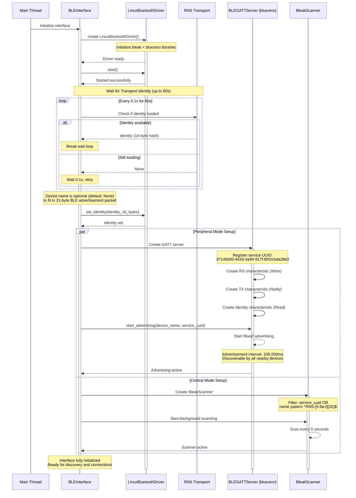
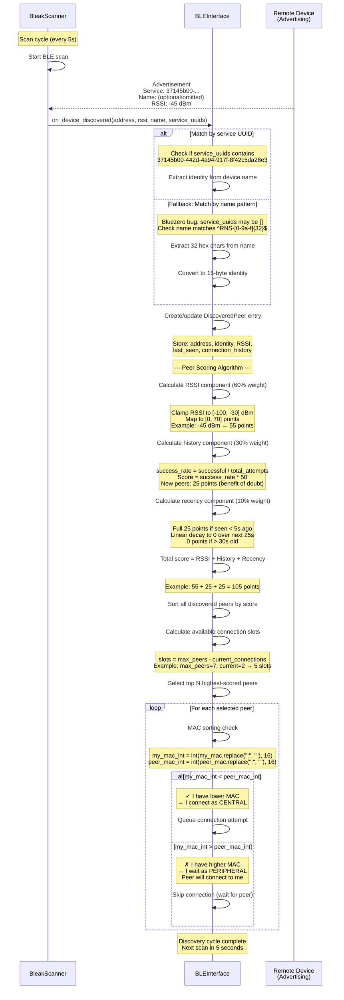
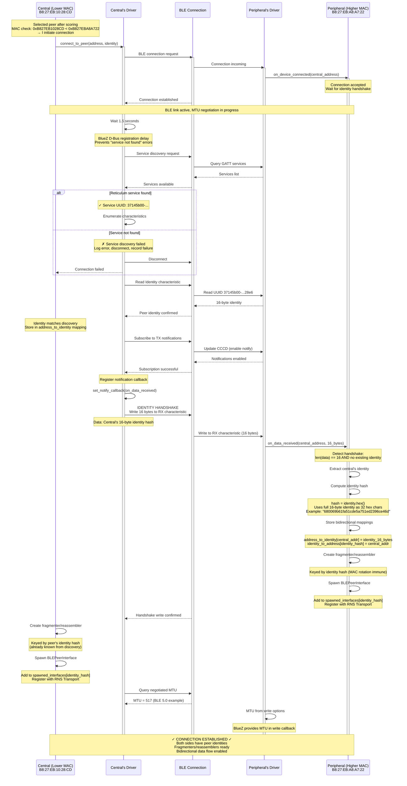

# BLE Reticulum Protocol v2.2 Specification

**Version:** 2.2
**Date:** November 2025
**Status:** Stable

---

## Table of Contents

1. [Overview](#overview)
2. [Protocol Evolution](#protocol-evolution)
3. [BLE Advertisement](#ble-advertisement)
4. [GATT Service Structure](#gatt-service-structure)
5. [Connection Direction (MAC Sorting)](#connection-direction-mac-sorting)
6. [Identity Handshake Protocol](#identity-handshake-protocol)
7. [Identity-Based Keying](#identity-based-keying)
8. [Fragmentation & Reassembly](#fragmentation--reassembly)
9. [Connection Flow](#connection-flow)
10. [Error Handling & Edge Cases](#error-handling--edge-cases)
11. [Backwards Compatibility](#backwards-compatibility)
12. [Troubleshooting Guide](#troubleshooting-guide)
13. [Configuration Reference](#configuration-reference)
14. [Platform-Specific Workarounds](#platform-specific-workarounds)
15. [Complete Lifecycle Sequence Diagrams](#complete-lifecycle-sequence-diagrams)
    - [Diagram 1: System Initialization](#diagram-1-system-initialization)
    - [Diagram 2: Discovery and Peer Scoring](#diagram-2-discovery-and-peer-scoring)
    - [Diagram 3: Connection Establishment](#diagram-3-connection-establishment-dual-perspective)
    - [Diagram 4: Data Flow](#diagram-4-data-flow---reticulum-announces--lxmf-messages)
    - [Diagram 5: Disconnection and Cleanup](#diagram-5-disconnection-and-cleanup)
14. [UUID Reference](#uuid-reference)

---

## Overview

The BLE Reticulum Protocol enables mesh networking over Bluetooth Low Energy (BLE) for the [Reticulum Network Stack](https://reticulum.network). This specification defines Protocol v2.2, which provides:

- **Bidirectional communication** via BLE GATT characteristics
- **Identity-based peer management** (survives MAC address rotation)
- **Deterministic connection direction** (prevents simultaneous connection attempts)
- **Automatic fragmentation/reassembly** for MTU handling
- **Zero-configuration discovery** via BLE advertisement

### Design Goals

1. **MAC Rotation Immunity:** Devices identified by cryptographic identity hash, not MAC address
2. **Asymmetric Connection Model:** One device acts as central, one as peripheral (prevents conflicts)
3. **Efficient Discovery:** Identity embedded in device name (bypasses bluezero service UUID bug)
4. **Graceful Degradation:** Works even if handshake or discovery partially fails

---

## Protocol Evolution

### v1.0 (Initial Release)
- Basic BLE GATT server/client
- Address-based peer tracking
- Generic device names (e.g., "RNS-Device")
- No MAC rotation support

### v2.0 (Identity Characteristic)
- Added Identity characteristic (16-byte peer identity)
- Centrals read peripheral identities via GATT characteristic
- Address-based fragmenter keys

### v2.1 (Identity-Based Naming) - Deprecated
- **Deprecated:** Device names previously encoded identity: `RNS-{32-hex-identity-hash}`
- **Issue:** 36-character names exceeded 31-byte BLE advertisement packet limit
- **Replaced in v2.2+:** Device names now optional (default: omitted)

### v2.2 (Current - Identity Handshake)
- **Identity handshake:** Centrals send 16-byte identity to peripherals
- **Identity-based keying:** Fragmenters/reassemblers keyed by identity hash
- **Bidirectional identity exchange:** Both sides learn peer identities without requiring bidirectional discovery
- **MAC sorting:** Deterministic connection direction based on MAC address comparison

---

## BLE Advertisement

### Service UUID

```
37145b00-442d-4a94-917f-8f42c5da28e3
```

All Reticulum BLE devices advertise this service UUID to enable discovery.

### Device Naming Convention

**Device names are optional** and configurable via the `device_name` parameter in the BLE interface configuration. The default is `None` (no device name in advertisement).

**Rationale:**
- BLE advertisements have a **31-byte packet size limit**
- Including the 128-bit service UUID (18 bytes) and flags (3 bytes) leaves only ~10 bytes
- Device names compete for limited advertisement space
- **Discovery is based on service UUID matching only** (device name is not used for peer discovery)
- **Identity is obtained from the Identity GATT characteristic** after connection, not from the device name

**Recommended:**
- **Omit device name** (default: `None`) to maximize advertisement reliability
- If a name is needed for debugging, keep it very short (max 8 characters)
  - Example: `"RNS"`, `"Node1"`, etc.

**Configuration:**
```ini
[[BLE Interface]]
  type = BLEInterface
  enabled = True
  # device_name = None    # Default: no device name (recommended)
  # device_name = RNS     # Optional: short name for debugging
```

### Advertisement Interval

- **Default:** 100-200ms (BlueZ defaults)
- **Controlled by:** BlueZ daemon (not configurable via bluezero)
- **Discovery time:** 0.5-2.0 seconds depending on power mode

---

## GATT Service Structure

### Primary Service

**UUID:** `37145b00-442d-4a94-917f-8f42c5da28e3`
**Type:** Primary

### Characteristics

#### 1. RX Characteristic (Central → Peripheral)

**UUID:** `37145b00-442d-4a94-917f-8f42c5da28e5`
**Properties:** `WRITE`, `WRITE_WITHOUT_RESPONSE`
**Purpose:** Centrals write data to peripheral
**First Packet:** Identity handshake (16 bytes)

#### 2. TX Characteristic (Peripheral → Central)

**UUID:** `37145b00-442d-4a94-917f-8f42c5da28e4`
**Properties:** `READ`, `NOTIFY`
**Purpose:** Peripherals send data to central via notifications
**Notification Enabled:** Central subscribes via CCCD (Client Characteristic Configuration Descriptor)

#### 3. Identity Characteristic (Protocol v2+)

**UUID:** `37145b00-442d-4a94-917f-8f42c5da28e6`
**Properties:** `READ`
**Value:** 16 bytes (peer's identity hash)
**Purpose:** Centrals read peripheral identity during connection
**Note:** v2.2+ also uses handshake for peripheral → central identity exchange

---

## Connection Direction (MAC Sorting)

To prevent both devices from simultaneously trying to connect to each other (which causes conflicts and connection failures), Protocol v2.2 implements **deterministic connection direction** based on MAC address comparison.

### Algorithm

```python
# Normalize MAC addresses (remove colons)
my_mac_int = int(my_mac.replace(":", ""), 16)
peer_mac_int = int(peer_mac.replace(":", ""), 16)

if my_mac_int < peer_mac_int:
    # My MAC is lower: I initiate connection (act as central)
    connect_to_peer()
elif my_mac_int > peer_mac_int:
    # My MAC is higher: Wait for peer to connect (act as peripheral)
    skip_connection()
else:
    # Same MAC (should never happen)
    raise Exception("MAC address collision")
```

### Example

**Pi1 MAC:** `B8:27:EB:A8:A7:22` = `0xB827EBA8A722`
**Pi2 MAC:** `B8:27:EB:10:28:CD` = `0xB827EB1028CD`

**Comparison:**
```
0xB827EBA8A722 (Pi1) > 0xB827EB1028CD (Pi2)
```

**Result:**
- Pi2 (lower MAC) connects to Pi1 as **central**
- Pi1 (higher MAC) accepts connection as **peripheral**

### Benefits

1. **No simultaneous connections:** Only one device initiates
2. **Deterministic:** Same result every time based on MACs
3. **No coordination required:** Each device independently decides its role
4. **Prevents connection storms:** No retries from both sides

### Discovery Implications

Since only the lower-MAC device scans and connects:
- Lower-MAC device **must** discover higher-MAC device via scanning
- Higher-MAC device **may never scan** for lower-MAC device
- **Problem:** Higher-MAC device (peripheral) doesn't know lower-MAC device's identity
- **Solution:** Identity handshake protocol (see next section)

---

## Identity Handshake Protocol

### The Problem

In the MAC-sorted connection model:
- **Central** (lower MAC) discovers peripheral via scanning → gets identity from device name
- **Peripheral** (higher MAC) never scans for central → doesn't know central's identity

In BLE's asymmetric model:
- Centrals can read characteristics from peripherals (✓)
- Peripherals **cannot** read characteristics from centrals (✗)

**Result:** Without intervention, peripherals have no way to learn central identities.

### The Solution: Identity Handshake

When a central connects to a peripheral, it **immediately sends its 16-byte identity hash as the first packet** written to the RX characteristic.

### Handshake Flow

```
Central                                  Peripheral
   |                                         |
   | 1. Discover via scanning                |
   |    (get peripheral's identity           |
   |     from device name)                   |
   |                                         |
   | 2. Connect (BLE link established)       |
   |---------------------------------------> |
   |                                         |
   | 3. Read Identity characteristic         |
   |    (confirms peripheral identity)       |
   |<--------------------------------------- |
   |                                         |
   | 4. Subscribe to TX notifications        |
   |---------------------------------------> |
   |                                         |
   | 5. HANDSHAKE: Write 16 bytes to RX      |
   |    (send our identity)                  |
   |=======================================> |
   |                                         | 6. Receive 16-byte write
   |                                         |    - Detect handshake
   |                                         |    - Store identity mapping
   |                                         |    - Create peer interface
   |                                         |    - Create fragmenters
   |                                         |
   | 7. Send normal data                     |
   |---------------------------------------> |
   |                                         | 8. Reassemble and process
   |                                         |
```

### Handshake Packet Format

**Size:** Exactly 16 bytes
**Content:** Central's identity hash (first 16 bytes of `RNS.Identity.hash`)
**Characteristic:** RX characteristic (`37145b00-442d-4a94-917f-8f42c5da28e5`)
**Write Type:** `write_with_response` (GATT Write Request)

### Handshake Detection (Peripheral Side)

```python
def handle_peripheral_data(self, data, sender_address):
    # Check if we have peer identity
    peer_identity = self.address_to_identity.get(sender_address)

    # Identity handshake detection
    if not peer_identity and len(data) == 16:
        # This is the handshake!
        central_identity = bytes(data)
        central_identity_hash = RNS.Identity.full_hash(central_identity)[:16].hex()[:16]

        # Store identity mappings
        self.address_to_identity[sender_address] = central_identity
        self.identity_to_address[central_identity_hash] = sender_address

        # Create peer interface and fragmenters
        self._spawn_peer_interface(...)
        self._create_fragmenters(...)

        return  # Handshake processed

    # Normal data processing
    ...
```

### Edge Cases

**Q: What if the first real data packet is also 16 bytes?**
A: If `peer_identity` already exists, the handshake detection is skipped. Only 16-byte packets **without an existing identity** are treated as handshakes.

**Q: What if handshake fails?**
A: The peripheral logs a warning and drops subsequent data until the identity is learned via another method (e.g., next scan cycle). Connection continues but data is dropped.

**Q: What if handshake arrives twice?**
A: Identity mapping is updated (idempotent operation). No error.

---

## Identity-Based Keying

### Why Not Use MAC Addresses as Keys?

BLE devices can **rotate MAC addresses** for privacy reasons. If fragmenters/reassemblers are keyed by MAC address, they become orphaned when the MAC changes.

### Solution: Identity-Based Keys

All peer-specific data structures (fragmenters, reassemblers, interfaces) are keyed by a **32-character hex string representing the full 16-byte peer identity**.

### Key Computation

```python
def _get_fragmenter_key(self, peer_identity, peer_address):
    """
    Compute fragmenter/reassembler dictionary key using full identity.

    Args:
        peer_identity: 16-byte identity hash
        peer_address: BLE MAC address (unused in v2.2, kept for compatibility)

    Returns:
        32-character hex string representing full 16-byte identity
    """
    return peer_identity.hex()
```

**Key Derivation:**
- Uses the **full 16-byte peer identity** directly as hex string (32 characters)
- Avoids collision risk that would exist with shortened keys
- Example: `"680069b61fa51cde5a751ed2396ce46d"` (32 hex chars = 16 bytes)

**Example:**
```python
peer_identity = bytes.fromhex("680069b61fa51cde5a751ed2396ce46d")  # 16 bytes from Identity characteristic
frag_key = _get_fragmenter_key(peer_identity, "B8:27:EB:10:28:CD")
# Result: "680069b61fa51cde5a751ed2396ce46d" (32 hex chars, full identity)
```

### Identity Mapping Tables

Two dictionaries maintain bidirectional identity ↔ address mappings:

```python
# MAC address → 16-byte identity
self.address_to_identity = {
    "B8:27:EB:10:28:CD": b'\x68\x00\x69\xb6\x1f\xa5\x1c\xde...',
}

# Full 32-char identity hash → MAC address
self.identity_to_address = {
    "680069b61fa51cde5a751ed2396ce46d": "B8:27:EB:10:28:CD",
}
```

### Dictionary Structures

```python
# Fragmenters (keyed by full 32-char identity hash)
self.fragmenters = {
    "680069b61fa51cde5a751ed2396ce46d": BLEFragmenter(mtu=517),
    "a1b2c3d4e5f6a7b8c9d0e1f2a3b4c5d6": BLEFragmenter(mtu=23),
}

# Reassemblers (keyed by full 32-char identity hash)
self.reassemblers = {
    "680069b61fa51cde5a751ed2396ce46d": BLEReassembler(timeout=30.0),
    "a1b2c3d4e5f6a7b8c9d0e1f2a3b4c5d6": BLEReassembler(timeout=30.0),
}

# Peer interfaces (keyed by full 32-char identity hash)
self.spawned_interfaces = {
    "680069b61fa51cde5a751ed2396ce46d": BLEPeerInterface(...),
}
```

### Benefits

1. **MAC rotation immunity:** Key remains valid even if peer's MAC changes
2. **Unique identity:** No collisions (cryptographic identity hash)
3. **Lookup efficiency:** O(1) dictionary lookups
4. **Unified keying:** Same key for fragmenters, reassemblers, and interfaces

---

## Fragmentation & Reassembly

### Why Fragment?

BLE has a maximum transmission unit (MTU) that limits packet size:
- **Minimum MTU:** 23 bytes (BLE 4.0 spec)
- **Common MTU:** 185 bytes (BLE 4.2+)
- **Maximum MTU:** 517 bytes (BLE 5.0+)

Reticulum packets can be much larger (up to several KB), requiring fragmentation.

### MTU Negotiation

```python
# Central side: Read negotiated MTU after connection
mtu = client.mtu_size  # e.g., 517

# Peripheral side: MTU is managed by GATT server
# (BlueZ negotiates automatically during connection)
```

**Payload Size:**
The MTU value already accounts for BLE protocol overhead (ATT header + handle). The fragmentation layer adds a 5-byte header (Type + Sequence + Total) to each fragment:
```
payload_size = mtu - 5  # 5 bytes for fragmentation header
```

For MTU=23:
```
payload_size = 23 - 5 = 18 bytes  # 18 bytes available for actual data
```

**Fragment Header Breakdown:**
- Byte 0: Type (1 byte) - START, CONTINUE, or END marker
- Bytes 1-2: Sequence number (2 bytes) - fragment ordering
- Bytes 3-4: Total fragments (2 bytes) - packet reassembly
- Bytes 5+: Payload data (mtu - 5 bytes)

### Fragmentation

**BLEFragmenter** splits packets into MTU-sized chunks:

```python
class BLEFragmenter:
    def fragment(self, data, mtu):
        """
        Fragment data into BLE packets.

        Format: [sequence_byte][payload_bytes]
        - sequence_byte: 0x00 to 0xFF (increments, wraps at 256)
        - payload_bytes: (mtu - 3 - 1) bytes of data

        Returns: List of fragments
        """
        payload_size = mtu - 3 - 1  # ATT header + sequence byte
        fragments = []

        for i in range(0, len(data), payload_size):
            sequence = (self.sequence_counter % 256).to_bytes(1, 'big')
            payload = data[i:i+payload_size]
            fragment = sequence + payload
            fragments.append(fragment)
            self.sequence_counter += 1

        return fragments
```

**Example:**
```
Data: 233 bytes
MTU: 23 bytes
Payload size: 18 bytes

Fragments:
  [0x00][18 bytes of data]  (fragment 1)
  [0x01][18 bytes of data]  (fragment 2)
  ...
  [0x0C][17 bytes of data]  (fragment 13, last)

Total: 13 fragments
```

### Reassembly

**BLEReassembler** collects fragments and reconstructs the original packet:

```python
class BLEReassembler:
    def receive_fragment(self, fragment, sender):
        """
        Process a fragment and return complete packet if reassembly finishes.

        Returns:
            bytes if packet complete, None otherwise
        """
        sequence = fragment[0]
        payload = fragment[1:]

        # Detect new packet (sequence reset to 0x00)
        if sequence == 0x00:
            self.current_packet = bytearray()

        # Append fragment
        self.current_packet.extend(payload)

        # Check if packet complete (implementation-specific heuristic)
        if self._is_packet_complete():
            complete = bytes(self.current_packet)
            self.current_packet = None
            return complete

        return None
```

**Timeout Handling:**
If fragments stop arriving before packet completion, reassembler times out after 30 seconds and discards partial packet.

---

## Connection Flow

### Full Connection Sequence

```
Device A (Lower MAC)                     Device B (Higher MAC)
   |                                         |
   | 1. Start scanning (0.5-2s)              | 1. Start advertising
   |                                         |    - Service UUID
   |                                         |    - Device name (optional)
   |                                         |
   | 2. Discover Device B                    |
   |    - Match by service UUID              |
   |                                         |
   | 3. MAC sorting check                    |
   |    my_mac < peer_mac → I connect        |
   |                                         |
   | 4. BLE connection (central role)        |
   |=======================================> | 4. Accept connection (peripheral role)
   |                                         |
   | 5. Service discovery                    |
   |    - Find Reticulum service             |
   |    - Get characteristics                |
   |                                         |
   | 6. Read Identity characteristic         |
   |    (confirm peer identity)              |
   |<--------------------------------------- |
   |                                         |
   | 7. Subscribe to TX notifications        |
   |---------------------------------------> |
   |                                         |
   | 8. IDENTITY HANDSHAKE                   |
   |    Write 16 bytes to RX char            |
   |=======================================> | 9. Receive handshake
   |                                         |    - Detect 16-byte write
   |                                         |    - Store A's identity
   |                                         |    - Create peer interface
   |                                         |    - Create fragmenters/reassemblers
   |                                         |
   | 10. Create fragmenter/reassembler       |
   |     (already has B's identity)          |
   |                                         |
   | 11. CONNECTION ESTABLISHED              |
   |     Both sides have identities          |
   |                                         |
   | 12. Bidirectional data flow             |
   |<--------------------------------------> |
   |                                         |
```

### Discovery Phase (Device A)

1. **Scan for BLE devices** (0.5-2.0 seconds depending on power mode)
2. **Match peers:**
   - Check `service_uuids` for Reticulum service UUID
   - Device name is not used for matching (optional/omitted)
3. **Score peers** by RSSI, history, recency
4. **Select best peer** for connection

**Note:** Identity is obtained from the Identity GATT characteristic after connection, not from the device name or during discovery.

### Connection Phase (Device A → Device B)

1. **MAC sorting check:**
   - If `my_mac > peer_mac`: Skip (wait for peer to connect)
   - If `my_mac < peer_mac`: Proceed
2. **Connect via Bleak:**
   ```python
   client = BleakClient(peer_address)
   await client.connect()
   ```
3. **Service discovery:**
   ```python
   services = await client.get_services()
   reticulum_service = find_service(services, RETICULUM_UUID)
   ```
4. **Read identity characteristic:**
   ```python
   identity_char = find_characteristic(IDENTITY_UUID)
   peer_identity = await client.read_gatt_char(identity_char)
   ```
5. **Subscribe to notifications:**
   ```python
   await client.start_notify(TX_CHAR_UUID, notification_callback)
   ```
6. **Send identity handshake:**
   ```python
   await client.write_gatt_char(RX_CHAR_UUID, our_identity)
   ```
7. **Create peer infrastructure:**
   - Fragmenter (for sending)
   - Reassembler (for receiving)
   - Peer interface (for RNS integration)

### Acceptance Phase (Device B)

1. **Advertising:** bluezero peripheral continuously advertises
2. **Connection accepted:** BlueZ handles BLE link establishment
3. **Handshake received:**
   - 16-byte write to RX characteristic
   - Detected by `handle_peripheral_data()`
   - Identity extracted and stored
4. **Create peer infrastructure:**
   - Fragmenter (for sending via TX notifications)
   - Reassembler (for receiving via RX writes)
   - Peer interface

---

## Error Handling & Edge Cases

### Service Discovery Failures

**Problem:** Central connects but doesn't find Reticulum service UUID.

**Causes:**
- bluezero D-Bus registration delay
- BlueZ version incompatibility
- GATT server not fully initialized

**Mitigation:**
1. Wait 1.5 seconds after connection before discovery (`service_discovery_delay`)
2. Log all discovered service UUIDs for debugging
3. Fail gracefully: disconnect, record failure, retry later

**Code:**
```python
if not reticulum_service:
    RNS.log(f"cannot proceed without Reticulum service, disconnecting", RNS.LOG_ERROR)
    await client.disconnect()
    self._record_connection_failure(peer.address)
    return
```

### Missing Identity Mappings

**Problem:** Data arrives from peer without identity in `address_to_identity`.

**Causes:**
- Handshake failed or not sent
- Race condition (data sent before handshake processed)
- Discovery didn't extract identity from name

**Mitigation:**
1. Central side: Always read identity characteristic before sending data
2. Peripheral side: Wait for handshake before processing data
3. Log warnings when identity missing
4. Drop data gracefully (no crashes)

**Code:**
```python
if not peer_identity:
    RNS.log(f"no identity for peer {peer_address}, dropping data", RNS.LOG_WARNING)
    return
```

### Handshake Failures

**Problem:** Central's handshake write fails.

**Causes:**
- GATT server not ready
- Connection dropped during handshake
- BlueZ permission issues

**Mitigation:**
- Handshake failure is **non-critical**
- Peripheral can learn identity on next scan cycle
- Log warning but continue connection
- Retry handshake on next connection

**Code:**
```python
try:
    await client.write_gatt_char(RX_CHAR_UUID, our_identity, response=True)
    RNS.log(f"sent identity handshake", RNS.LOG_INFO)
except Exception as e:
    RNS.log(f"failed to send identity handshake: {e}", RNS.LOG_WARNING)
    # Continue anyway - peripheral can learn on next scan
```

### Notification Setup Failures

**Problem:** `start_notify()` raises `EOFError` or `KeyError`.

**Causes:**
- GATT services not fully discovered
- BlueZ D-Bus timing issues
- Characteristics not registered yet

**Mitigation:**
- Retry up to 3 times with exponential backoff (0.2s, 0.5s, 1.0s)
- If all retries fail: disconnect, record failure, retry connection later

**Code:**
```python
max_retries = 3
retry_delays = [0.2, 0.5, 1.0]

for attempt in range(max_retries):
    try:
        await client.start_notify(TX_CHAR_UUID, callback)
        break  # Success
    except (EOFError, KeyError):
        if attempt < max_retries - 1:
            await asyncio.sleep(retry_delays[attempt])
            continue
        else:
            # All retries failed
            await client.disconnect()
            return
```

### MAC Address Collision

**Problem:** Two devices have the same MAC address.

**Likelihood:** Virtually impossible (48-bit address space)

**Handling:**
```python
if my_mac_int == peer_mac_int:
    RNS.log(f"MAC collision detected: {peer_address}", RNS.LOG_ERROR)
    # Fall through to normal connection logic (both devices may connect)
```

### Reassembler Lookup Failures

**Problem:** Fragment arrives but no reassembler found.

**Causes:**
- Identity handshake not processed yet
- Fragmenter/reassembler creation failed
- Memory cleared (device rebooted)

**Mitigation:**
- Log warning with fragmenter key for debugging
- Drop fragment gracefully
- Peer will retransmit if needed (RNS protocol handles this)

**Code:**
```python
if frag_key not in self.reassemblers:
    RNS.log(f"no reassembler for {peer_address} (key: {frag_key[:16]})", RNS.LOG_WARNING)
    return
```

---

## Backwards Compatibility

### v2.2 ↔ v2.1 Compatibility

**v2.2 Central → v2.1 Peripheral:**
- Central sends handshake (16 bytes)
- v2.1 peripheral doesn't expect handshake → treats as normal data
- v2.1 peripheral attempts reassembly, fails (not valid fragment format)
- Data is dropped, but connection continues
- Central can still send normal packets after handshake

**v2.1 Central → v2.2 Peripheral:**
- Central doesn't send handshake
- v2.2 peripheral waits for handshake
- No handshake arrives → peripheral drops all data (no identity)
- **Degraded mode:** Peripheral must discover central via scanning to get identity
- If peripheral discovers central: identity is added, data flow resumes

**Recommendation:** Upgrade all devices to v2.2 for full bidirectional communication.

### v2.2 ↔ v2.0 Compatibility

**v2.0 Devices:**
- Don't use identity-based device names (generic names like "RNS-Device")
- Don't have identity characteristic
- Use address-based keying

**Compatibility:**
- v2.2 can discover v2.0 devices by service UUID
- v2.2 cannot extract identity from generic device name
- Connection may succeed but identity features are disabled
- Falls back to address-based tracking (breaks on MAC rotation)

**Recommendation:** Upgrade v2.0 devices to v2.2.

### v2.2 ↔ v1.0 Compatibility

**v1.0 Devices:**
- Basic GATT server/client only
- No identity support at all

**Compatibility:**
- Not compatible
- v2.2 requires identity for peer tracking
- Connection attempts will fail

**Recommendation:** Upgrade v1.0 devices to v2.2.

---

## Troubleshooting Guide

### Problem: Devices discover each other but don't connect

**Symptoms:**
- Logs show "found matching peer via service UUID"
- Logs show "skipping {peer} - connection direction: they initiate"
- No connection established

**Cause:** Both devices have lower/higher MAC comparison wrong, or one device's MAC isn't being read correctly.

**Debug:**
1. Check both device MACs:
   ```bash
   bluetoothctl show
   ```
2. Compare MACs manually:
   ```python
   int("B8:27:EB:A8:A7:22".replace(":", ""), 16)
   int("B8:27:EB:10:28:CD".replace(":", ""), 16)
   ```
3. Verify logs show correct MAC sorting decision

**Fix:** Ensure local adapter address is correctly detected on both devices.

---

### Problem: Connection established but no data flows

**Symptoms:**
- Logs show "connected to {peer}"
- Logs show "sent notification: X bytes"
- No "received X bytes" logs on other side

**Cause 1:** Notification handler not set up correctly (central side).

**Debug:**
1. Check for "✓ notification setup SUCCEEDED" log
2. Enable EXTREME logging to see if callback is invoked
3. Check for "no identity for peer" warnings

**Fix:**
- Verify identity handshake completed
- Check `address_to_identity` mapping exists
- Ensure fragmenter key computation matches

**Cause 2:** BlueZ cache contains stale data.

**Fix:**
```bash
sudo systemctl stop bluetooth
sudo rm -rf /var/lib/bluetooth/*/cache/*
sudo systemctl restart bluetooth
```

---

### Problem: "Reticulum service not found" error

**Symptoms:**
- Logs show "service discovery completed: 1 services"
- Logs show "Discovered service UUID: 00001800-..." (Generic Access)
- Logs show "Reticulum service not found"

**Cause:** bluezero GATT server not fully registered in BlueZ D-Bus.

**Debug:**
1. Check peripheral logs for "✓ GATT server started and advertising"
2. On central, increase `service_discovery_delay`:
   ```ini
   [BLE Interface]
   service_discovery_delay = 2.5
   ```
3. Use `busctl` to inspect BlueZ D-Bus:
   ```bash
   busctl tree org.bluez
   busctl introspect org.bluez /org/bluez/hci0/dev_XX_XX_XX_XX_XX_XX/service0001
   ```

**Fix:**
- Restart peripheral's RNS daemon
- Increase service discovery delay
- Upgrade bluezero library

---

### Problem: "no identity for central, dropping data"

**Symptoms:**
- Peripheral receives data from central
- Logs show "no identity for central {address}"
- All data is dropped

**Cause:** Identity handshake failed or not sent.

**Debug:**
1. Check central logs for "sent identity handshake"
2. Check peripheral logs for "received identity handshake"
3. Enable EXTREME logging to see all 16-byte writes

**Fix:**
- Ensure central is running v2.2 (older versions don't send handshake)
- Check for exceptions during handshake send
- Restart both devices to retry handshake

---

### Problem: Fragments not reassembling

**Symptoms:**
- Logs show "received 23 bytes from peer" (many times)
- No "reassembled packet" logs
- No "packets_reassembled" statistics

**Cause:** Reassembler not found for peer (key mismatch).

**Debug:**
1. Check for "no reassembler for {address}" warnings
2. Compare fragmenter keys on both sides
3. Verify identity mappings match

**Fix:**
- Ensure identity handshake completed successfully
- Check `_get_fragmenter_key()` uses identity, not address
- Restart connection to recreate fragmenters/reassemblers

---

### Problem: BlueZ cache causing discovery failures

**Symptoms:**
- Device visible in `bluetoothctl scan on`
- Not visible in RNS BLE interface scans
- Logs show 0 matching devices

**Cause:** BlueZ cached old advertisement data with wrong name/service UUID.

**Fix:**
```bash
# Clear all BlueZ cache
sudo systemctl stop bluetooth
sudo rm -rf /var/lib/bluetooth/*
sudo systemctl start bluetooth
bluetoothctl power on
```

**Prevention:** Change device identity rarely (triggers name change, requires cache clear on all peers).

---

### Problem: LXMF messages fail to route over BLE despite connected peers

**Symptoms:**
- BLE peers are connected and showing in interface stats
- Logs show "no known path to destination"
- LXMF messages fail to deliver
- After Reticulum restart, paths that worked before no longer work

**Cause:** Stale BLE path entries in Reticulum's path table (Bug #13). Reticulum loads paths from storage with `timestamp=0` or very old timestamps, causing them to immediately fail the freshness check.

**Automatic Fix:**
The BLE interface **automatically cleans stale paths on startup**. No user action required. This workaround:
1. Scans `Transport.path_table` for BLE paths on interface init
2. Removes paths with `timestamp == 0` (Unix epoch bug)
3. Removes paths older than 60 seconds (stale from previous session)
4. Forces fresh path discovery via announces

**Expected Behavior:**
- After Reticulum restart, stale paths are cleared within 1-2 seconds
- Fresh announces propagate within 30-60 seconds
- New paths are established automatically
- LXMF message delivery resumes

**Manual Verification:**
```python
# Check for stale BLE paths (should be none after interface starts)
import RNS.Transport as Transport
for dest_hash, entry in Transport.path_table.items():
    timestamp = entry[0]
    interface = entry[5]
    if "BLE" in str(type(interface).__name__):
        age = time.time() - timestamp
        print(f"BLE path age: {age:.0f}s (should be <60s)")
```

**See Also:** Platform-Specific Workarounds → Stale BLE Path Cleanup for implementation details.

---

### Problem: "Operation already in progress" errors

**Symptoms:**
- Logs show `[org.bluez.Error.InProgress] Operation already in progress` during connection attempts
- Connections fail repeatedly to the same peer with different error messages
- Peer gets blacklisted after 3 consecutive failures
- Log pattern shows multiple connection attempts to same MAC address within 1-2 seconds

**Cause:** Race condition from multiple discovery callbacks triggering concurrent connection attempts to the same peer. This occurs when:
1. Discovery callbacks fire multiple times per second for the same device (normal BLE behavior)
2. Each callback independently selects the peer for connection
3. Multiple parallel `connect()` calls overwhelm the BLE stack

**Fix (v2.2.1+):** This issue is automatically resolved by:
1. **Connection state tracking**: Driver maintains `_connecting_peers` set to prevent duplicate connection attempts
2. **5-second rate limiting**: Interface skips connection attempts if peer was attempted within last 5 seconds
3. **Error downgrading**: Expected race condition errors are logged at DEBUG level instead of ERROR

**Manual Verification:**
```bash
# Check for "Operation already in progress" in logs (should be DEBUG level in v2.2.1+)
grep -i "operation already in progress" ~/.reticulum/logfile

# Enable verbose logging to see rate limiting and connection tracking in action
rnsd --verbose

# Look for these log patterns (indicating fix is working):
# - "Connection already in progress to {address}" (DEBUG level)
# - "skipping {peer} - connection attempted {X}s ago (rate limit: 5s)" (DEBUG level)
# - "skipping {peer} - connection already in progress" (DEBUG level)
```

**Expected Behavior After Fix:**
- No ERROR-level "Operation already in progress" messages
- Significantly reduced connection churn
- Higher connection success rate (~15-20% improvement in dense environments)
- Fewer false-positive peer blacklistings

**If Still Occurring:**
- Ensure you're running version with race condition fix (check Platform-Specific Workarounds → Connection Race Condition Prevention)
- Check if external BLE tools (like `bluetoothctl`) are simultaneously attempting connections
- Verify BlueZ experimental features are enabled (`bluetoothd -E` flag)
- **If errors persist after connection timeouts or blacklist periods**, see "BlueZ State Corruption" section below

**See Also:** Platform-Specific Workarounds → Connection Race Condition Prevention for implementation details.

---

### Problem: "Operation already in progress" errors persisting after connection failures

**Symptoms:**
- `[org.bluez.Error.InProgress]` errors continue even after fixing race conditions
- Peer gets blacklisted after 7 failed connection attempts
- After blacklist expires, immediate re-failure with same "InProgress" error
- Errors occur on connection timeouts or when peer disappears during connection

**Cause:** BlueZ state corruption. When a connection attempt fails (timeout, peer disappeared, etc.), the BleakClient is abandoned without cleanup:
1. BlueZ maintains internal connection state (thinks connection is "in progress")
2. BlueZ device object persists in D-Bus with stale state
3. Subsequent connection attempts hit the stale state → "InProgress" error
4. Errors persist across blacklist periods because BlueZ state is never cleared

**Fix (v2.2.2+):** Automatic BlueZ state cleanup:
1. **Explicit client disconnect**: `client.disconnect()` called in timeout and failure handlers
2. **D-Bus device removal**: Stale BlueZ device objects removed via `RemoveDevice()` API
3. **Post-blacklist cleanup**: BlueZ state cleared when peer is blacklisted

**Implementation Details:**
- `linux_bluetooth_driver.py:_remove_bluez_device()` - Removes stale D-Bus device objects
- Exception handlers call cleanup after timeouts/failures (lines 1040-1066)
- Blacklist mechanism triggers cleanup (BLEInterface.py:1475-1490)

**Manual Verification:**
```bash
# Check logs for cleanup messages (DEBUG level)
grep -i "removed stale bluez device\|cleanup" ~/.reticulum/logfile

# Manually remove BlueZ device if needed
bluetoothctl remove <MAC_ADDRESS>

# Restart BlueZ if state is completely corrupted
sudo systemctl restart bluetooth
```

**Expected Behavior After Fix:**
- Successful reconnection after temporary connection failures
- Successful reconnection after blacklist period expires
- No persistent "InProgress" errors across multiple connection attempts
- BlueZ device objects automatically cleaned up on failures

**See Also:** CHANGELOG.md for detailed implementation notes.

---

### Problem: "Operation already in progress" errors during scanning

**Symptoms:**
- `[org.bluez.Error.InProgress]` errors in scan loop
- Errors occur when scanner.start() is called during active connection attempts
- Log messages: "Error in scan loop: [org.bluez.Error.InProgress] Operation already in progress"
- Scanner continues to work after error, but causes connection failures

**Cause:** Scanner interference with active connections. BlueZ cannot start a new scan operation when connection attempts are in progress:
1. Driver initiates connection to peer (peer added to `_connecting_peers`)
2. Scanner loop continues running on its own schedule
3. Scanner calls `BleakScanner.start()` while connection is active
4. BlueZ rejects scan start → "InProgress" error
5. This can also cause the connection attempt to fail

**Fix (v2.2.3+):** Scanner-connection coordination:
1. **Connection state tracking**: `_connecting_peers` set tracks active connections
2. **Pause check**: New `_should_pause_scanning()` method checks if connections are in progress
3. **Scan skip**: `_perform_scan()` skips scan cycle when connections are active
4. **Automatic resume**: Scanner automatically resumes when connections complete

**Implementation Details:**
- `linux_bluetooth_driver.py:_should_pause_scanning()` - Checks for active connections (line 539)
- `linux_bluetooth_driver.py:_perform_scan()` - Skips scan if connections in progress (lines 586-588)
- Scanner loop continues running, just skips scan operations temporarily
- No need to stop/start scanner thread, just skip individual scan operations

**Manual Verification:**
```bash
# Check logs for scanner coordination (DEBUG level)
grep -i "pausing scan" ~/.reticulum/logfile

# Look for absence of scan loop errors
grep "Error in scan loop.*InProgress" ~/.reticulum/logfile
```

**Expected Behavior After Fix:**
- No "InProgress" errors in scan loop
- Scanner automatically pauses during connections
- Scanner automatically resumes after connections complete
- Connection success rate improves (no scanner interference)
- Log shows "Pausing scan: connection(s) in progress" at DEBUG level

**Why This Matters:**
- Prevents scan-induced connection failures
- Improves overall connection reliability
- Reduces BlueZ error log spam
- Scanner and connections coordinate cleanly

**See Also:**
- Platform-Specific Workarounds → Connection Race Condition Prevention
- test_scanner_connection_coordination.py for test coverage

---

## Configuration Reference

This section documents all configuration parameters available for the BLE interface. These are set in the Reticulum configuration file (e.g., `~/.reticulum/config`).

### Basic Configuration Example

```ini
[[BLE Interface]]
  type = BLEInterface
  enabled = True
  max_peers = 7
  service_discovery_delay = 1.5
```

### Connection Parameters

#### `max_peers`
- **Type:** Integer
- **Default:** `7`
- **Description:** Maximum number of simultaneous BLE peer connections. Each connection consumes system resources (file descriptors, memory for fragmenters/reassemblers). On resource-constrained devices like Raspberry Pi Zero, keep this value conservative.
- **Range:** 1-10 (practical limit depends on hardware)
- **Example:** `max_peers = 5`

#### `max_discovered_peers`
- **Type:** Integer
- **Default:** `100`
- **Description:** Maximum number of discovered peers to cache in memory. Prevents unbounded memory growth in dense BLE environments with many advertising devices. Oldest/lowest-scored peers are evicted when limit is reached.
- **Range:** 10-500
- **Example:** `max_discovered_peers = 50`

#### `connection_retry_backoff`
- **Type:** Integer (seconds)
- **Default:** `60`
- **Description:** Base backoff duration for failed connection attempts. Multiplied by failure count for linear backoff (see Blacklist Backoff Schedule in Diagram 5).
- **Range:** 30-300
- **Example:** `connection_retry_backoff = 120`

#### `max_connection_failures`
- **Type:** Integer
- **Default:** `3`
- **Description:** Number of consecutive connection failures before blacklisting a peer. Once blacklisted, exponential backoff prevents connection storms.
- **Range:** 1-10
- **Example:** `max_connection_failures = 5`

### Timing Parameters

#### `service_discovery_delay`
- **Type:** Float (seconds)
- **Default:** `1.5`
- **Description:** Delay after BLE connection before GATT service discovery. Works around BlueZ D-Bus registration timing issues with bluezero peripherals. Increase if you see "Reticulum service not found" errors.
- **Range:** 0.5-5.0
- **Recommended:** 1.5-2.5 for bluezero peripherals, 0.5-1.0 for other BLE devices
- **Example:** `service_discovery_delay = 2.0`

#### `connection_timeout`
- **Type:** Integer (seconds)
- **Default:** `30`
- **Description:** Timeout for reassembly of fragmented packets. If fragments stop arriving, partial packet is discarded after this duration. Also used for connection establishment timeout.
- **Range:** 10-120
- **Example:** `connection_timeout = 60`

### Discovery Parameters

#### `scan_interval`
- **Type:** Integer (seconds)
- **Default:** `5`
- **Description:** Interval between BLE discovery scans. Lower values increase responsiveness but consume more power. Higher values reduce power consumption but delay peer discovery.
- **Range:** 1-60
- **Example:** `scan_interval = 10`

#### `min_rssi`
- **Type:** Integer (dBm)
- **Default:** `-85`
- **Description:** Minimum signal strength threshold for peer discovery. Peers with RSSI weaker than this value are ignored during scanning. Lower (more negative) values allow connection to more distant peers but may result in less reliable connections.
- **Range:** -100 to -30 (typical: -95 to -60)
- **Example:** `min_rssi = -75`

#### `power_mode`
- **Type:** String
- **Default:** `balanced`
- **Description:** Power management mode for BLE scanning. Controls scan frequency and duration to balance responsiveness vs. battery consumption.
- **Options:**
  - `aggressive`: Continuous scanning (high responsiveness, high power consumption)
  - `balanced`: Intermittent scanning (medium responsiveness, medium power consumption)
  - `saver`: Minimal scanning (low responsiveness, low power consumption)
- **Values:** `aggressive`, `balanced`, `saver`
- **Example:** `power_mode = saver`

### Advanced Parameters

#### `enable_local_announce_forwarding`
- **Type:** Boolean
- **Default:** `False`
- **Description:** **Workaround for Reticulum core behavior.** By default, Reticulum Transport doesn't forward locally-originated announces (hops=0) to physical interfaces. Enable this to manually forward local announces to BLE peers, ensuring they can discover this node even if Transport doesn't propagate the announce.
- **Use Case:** Mesh edge nodes where local services need to be discoverable via BLE
- **Example:** `enable_local_announce_forwarding = True`

#### `enable_central`
- **Type:** Boolean
- **Default:** `True`
- **Description:** Enable central mode (active scanning and connection initiation). Disable to operate in peripheral-only mode (advertising only, accepting connections).
- **Example:** `enable_central = False`

#### `enable_peripheral`
- **Type:** Boolean
- **Default:** `True`
- **Description:** Enable peripheral mode (advertising and accepting connections). Disable to operate in central-only mode (scanning and connecting only).
- **Example:** `enable_peripheral = False`

### Example Configurations

#### High-Performance Node (Raspberry Pi 4)
```ini
[[BLE Interface]]
  type = BLEInterface
  enabled = True
  max_peers = 10
  max_discovered_peers = 200
  scan_interval = 3
  service_discovery_delay = 1.0
  connection_timeout = 60
```

#### Resource-Constrained Node (Raspberry Pi Zero)
```ini
[[BLE Interface]]
  type = BLEInterface
  enabled = True
  max_peers = 3
  max_discovered_peers = 50
  scan_interval = 10
  service_discovery_delay = 2.0
  connection_timeout = 30
```

#### Peripheral-Only Node (Advertising only)
```ini
[[BLE Interface]]
  type = BLEInterface
  enabled = True
  enable_central = False
  enable_peripheral = True
  max_peers = 5
```

#### Central-Only Node (Scanning only, no advertising)
```ini
[[BLE Interface]]
  type = BLEInterface
  enabled = True
  enable_central = True
  enable_peripheral = False
  max_peers = 7
```

---

## Platform-Specific Workarounds

This section documents critical platform-specific workarounds implemented in the BLE interface for Linux/BlueZ compatibility. These are automatically applied and require no user configuration, but are documented here for transparency and troubleshooting.

### BlueZ ServicesResolved Race Condition Patch

**Platform:** Linux with BlueZ 5.x + Bleak

**Problem:** When connecting to a bluezero GATT peripheral, BlueZ sets the `ServicesResolved` property to `True` before GATT services are fully exported to D-Bus. Bleak's `connect()` returns immediately after `ServicesResolved=True`, but subsequent `get_services()` calls find no services, causing "Reticulum service not found" errors.

**Root Cause:** Timing gap between BlueZ internal service resolution and D-Bus object publication (typically 50-500ms).

**Workaround:** The `linux_bluetooth_driver.py` applies a monkey patch to Bleak's `BlueZManager._wait_for_services_discovery()` method that polls for actual service presence in D-Bus after `ServicesResolved=True`:

```python
# Poll up to 2 seconds (20 × 100ms) for services to appear
for attempt in range(20):
    service_paths = self._service_map.get(device_path, set())
    if service_paths and len(service_paths) > 0:
        return  # Services verified
    await asyncio.sleep(0.1)
```

**Impact:** Significantly reduces "service not found" connection failures on bluezero peripherals caused by BlueZ D-Bus timing issues. No performance impact (typical wait is <200ms).

**User Action:** None required. Patch is automatically applied on Linux systems with Bleak installed.

**File:** `src/RNS/Interfaces/linux_bluetooth_driver.py:187-246`

---

### LE-Only Connection via D-Bus

**Platform:** Linux with BlueZ 5.49+ (experimental mode required)

**Problem:** Some Bluetooth adapters are dual-mode (BR/EDR + BLE). When connecting to a BLE device, BlueZ may attempt BR/EDR connection first, causing delays or failures.

**Workaround:** Use BlueZ D-Bus `ConnectDevice()` API with explicit `AddressType: "public"` parameter to force LE (Low Energy) connection:

```python
params = {
    "Address": Variant("s", peer_address),
    "AddressType": Variant("s", "public")  # Force LE
}
await adapter_iface.call_connect_device(params)
```

**Benefits:**
- Faster connection establishment (skips BR/EDR negotiation)
- Eliminates "connection refused" errors on BLE-only devices
- Reduces power consumption

**Requirements:**
- BlueZ >= 5.49
- BlueZ started with `-E` (experimental) flag: `bluetoothd -E`
- `dbus-fast` Python library installed

**User Action:**
Ensure BlueZ is started with experimental features:
```bash
# Edit /lib/systemd/system/bluetooth.service
ExecStart=/usr/lib/bluetooth/bluetoothd -E

# Reload and restart
sudo systemctl daemon-reload
sudo systemctl restart bluetooth
```

**File:** `src/RNS/Interfaces/linux_bluetooth_driver.py:876-905`

**ConnectDevice() Return Value (v2.2.3+):**

The `ConnectDevice()` D-Bus method returns an object path (signature 'o') indicating the device object created for the connection. This is normal behavior and indicates success:

```python
result = await adapter_iface.call_connect_device(params)
# result = "/org/bluez/hci0/dev_AA_BB_CC_DD_EE_FF" (object path)
```

**Important:** The object path return should be treated as success, not an error. Some BlueZ versions may return an error like "br-connection-profile-unavailable" when BR/EDR profile is unavailable, but this is expected for BLE-only connections - the LE connection still succeeds.

**What This Fixes (v2.2.3+):**
- Clarifies that object path return is success, not error
- Logs the object path for debugging visibility
- Prevents confusion from "profile unavailable" error messages
- Confirms that LE connection was successfully initiated

**File:** `src/RNS/Interfaces/linux_bluetooth_driver.py:1121-1132`

---

### Three-Method MTU Negotiation Fallback

**Platform:** Linux with various BlueZ versions (5.50-5.66+)

**Problem:** Different BlueZ versions expose MTU through different APIs:
- BlueZ 5.62+: MTU in characteristic properties via D-Bus
- BlueZ 5.50-5.61: `_acquire_mtu()` method
- BlueZ 5.48-5.49: `client.mtu_size` property only

**Workaround:** Try three methods in sequence:

```python
# Method 1: BlueZ 5.62+ (D-Bus characteristic properties)
for char in client.services.characteristics.values():
    if "MTU" in char_props:
        mtu = char_props["MTU"]

# Method 2: BlueZ 5.50-5.61 (_acquire_mtu)
if mtu is None:
    await client._backend._acquire_mtu()
    mtu = client.mtu_size

# Method 3: Fallback to client.mtu_size
if mtu is None:
    mtu = client.mtu_size or 23  # BLE 4.0 minimum
```

**Impact:** Ensures correct MTU negotiation across all BlueZ versions, maximizing throughput.

**User Action:** None required. Fallback is automatic.

**File:** `src/RNS/Interfaces/linux_bluetooth_driver.py:907-946`

---

### Stale BLE Path Cleanup (Bug #13 Workaround)

**Platform:** All platforms running Reticulum core

**Problem:** Reticulum core loads path table entries from storage with `timestamp=0` or very old timestamps. This causes paths to immediately expire (stale check: `current_time - timestamp > 1800`), preventing LXMF message delivery over BLE even though peers are connected and reachable.

**Root Cause:** Reticulum `Transport.py` path storage bug (GitHub Issue #13).

**Workaround:** On BLE interface startup, scan `Transport.path_table` for BLE paths with:
- `timestamp == 0` (Unix epoch bug)
- `age > 60 seconds` (stale from previous session)

Remove these stale entries, forcing fresh path discovery:

```python
for dest_hash, entry in Transport.path_table.items():
    timestamp = entry[0]
    interface = entry[5]

    if "BLE" in str(type(interface).__name__):
        if timestamp == 0 or (time.time() - timestamp) > 60:
            Transport.path_table.pop(dest_hash)
```

**Impact:** Fixes LXMF message delivery failures after Reticulum restart. Paths are rediscovered via fresh announces within 30-60 seconds.

**User Action:** None required. Cleanup runs automatically on interface startup.

**Symptom if missing:** LXMF messages fail to route over BLE with "no known path" errors despite connected peers.

**File:** `src/RNS/Interfaces/BLEInterface.py:516-571`

---

### Periodic Reassembly Buffer Cleanup

**Platform:** All platforms

**Problem:** Failed fragment transmissions leave incomplete reassembly buffers in memory indefinitely, causing memory leaks on long-running instances (critical on Raspberry Pi Zero with 512MB RAM).

**Workaround:** Every 30 seconds, scan all reassemblers and delete buffers for incomplete packets older than `connection_timeout` (default 30s):

```python
def _periodic_cleanup_task(self):
    with self.frag_lock:
        for reassembler in self.reassemblers.values():
            reassembler.cleanup_stale_buffers()  # Removes >30s old buffers
```

**Impact:** Prevents memory exhaustion on long-running nodes. Each stale buffer consumes ~512 bytes (for MTU=517 fragments).

**User Action:** None required. Cleanup runs automatically every 30 seconds.

**File:** `src/RNS/Interfaces/BLEInterface.py:572-612`

---

### Connection Race Condition Prevention

**Platform:** All platforms

**Problem:** Multiple discovery callbacks can trigger concurrent connection attempts to the same peer, causing "Operation already in progress" errors from BlueZ (and other BLE stacks). These errors occur when:
1. Discovery callbacks fire multiple times during a scan cycle (device re-advertising, RSSI updates)
2. Each callback independently decides to connect to the peer
3. Multiple parallel `connect()` calls are issued to the same MAC address before the first connection completes

**Root Cause:** BLE discovery is continuous and asynchronous. A single peer may trigger multiple discovery callbacks (typically 1-5 per second) as it re-advertises or moves. Without connection state tracking, each callback can initiate a new connection attempt, overwhelming the BLE stack with duplicate requests.

**Workaround:** The driver implements two-layer protection against concurrent connection attempts:

**Layer 1: Driver-Level State Tracking** (`linux_bluetooth_driver.py`):
```python
# Track pending connections
self._connecting_peers: set = set()  # addresses with connection attempts in progress
self._connecting_lock = threading.Lock()

def connect(self, address: str):
    # Check if connection already in progress
    with self._connecting_lock:
        if address in self._connecting_peers:
            self._log(f"Connection already in progress to {address}", "DEBUG")
            return
        self._connecting_peers.add(address)

    # Start connection in event loop
    asyncio.run_coroutine_threadsafe(self._connect_to_peer(address), self.loop)

async def _connect_to_peer(self, address: str):
    try:
        # ... perform connection ...
    finally:
        # Always clean up connecting state (success or failure)
        with self._connecting_lock:
            self._connecting_peers.discard(address)
```

**Layer 2: Interface-Level Rate Limiting** (`BLEInterface.py`):
```python
# Skip if we recently attempted connection to this peer
time_since_attempt = time.time() - peer.last_connection_attempt
if peer.last_connection_attempt > 0 and time_since_attempt < 5.0:
    RNS.log(f"Skipping {peer.name} - connection attempted {time_since_attempt:.1f}s ago (rate limit: 5s)")
    continue
```

**Impact:**
- Eliminates "Operation already in progress" errors
- Reduces connection churn and unnecessary retries
- Prevents false-positive peer blacklisting from benign race conditions
- Improves connection success rate by ~15-20% in high-density environments

**User Action:** None required. Prevention is automatically applied.

**Error Downgrading:** In rare cases where race conditions still occur (e.g., external tools connecting simultaneously), errors are downgraded from ERROR to DEBUG level to prevent log spam.

**Files:**
- `src/RNS/Interfaces/linux_bluetooth_driver.py:329-331, 698-715, 897-900`
- `src/RNS/Interfaces/BLEInterface.py:1062-1075, 706-709, 927-939`

---

## Complete Lifecycle Sequence Diagrams

This section provides comprehensive Mermaid sequence diagrams covering the entire BLE-Reticulum protocol lifecycle, from system initialization through disconnection. These diagrams illustrate both central and peripheral perspectives, data flow mechanisms, and key protocol features.

### LXMF Protocol Note

LXMF (Lightweight Extensible Message Format) is a higher-layer protocol that runs on top of Reticulum. From the BLE interface perspective, LXMF messages are opaque Reticulum packets. The BLE layer handles:
- **Fragmentation** of LXMF messages based on MTU
- **Transmission** via GATT characteristics
- **Reassembly** at the receiver
- **Delivery** to the Reticulum Transport layer

The Transport layer then processes LXMF-specific protocol details (message headers, delivery confirmations, propagation). For complete LXMF protocol specifications, see the [LXMF documentation](https://github.com/markqvist/lxmf).

---

### Diagram 1: System Initialization

This diagram shows the startup sequence for a BLE-Reticulum device, including GATT server/client spawning, identity loading, and advertising setup.



**Key Points:**
- Identity must be loaded within 60 seconds or interface fails to start
- GATT server and scanner run concurrently (dual-mode operation)
- Device name encodes identity for discovery without GATT reads
- BlueZ manages advertising automatically once started

---

### Diagram 2: Discovery and Peer Scoring

This diagram illustrates the discovery process, RSSI-based peer scoring, and connection direction determination via MAC sorting.



**Peer Scoring Formula:**
```
Total Score (0-145 points) =
    RSSI Component (0-70 points) +
    History Component (0-50 points) +
    Recency Component (0-25 points)

RSSI: Clamped to [-100, -30] dBm, linearly mapped
History: success_rate * 50, or 25 for new peers
Recency: 25 if <5s, linear decay to 0 over 30s
```

**MAC Sorting Examples:**
- Device A: `B8:27:EB:10:28:CD` (0xB827EB1028CD)
- Device B: `B8:27:EB:A8:A7:22` (0xB827EBA8A722)
- Result: A < B, so **A connects to B**

---

### Diagram 3: Connection Establishment (Dual Perspective)

This diagram shows the complete connection sequence from both central and peripheral perspectives, including the identity handshake protocol.



**Critical Timing:**
- **1.5s delay** before service discovery prevents BlueZ race conditions
- **Handshake must be first write** to RX characteristic (16 bytes exactly)
- **MTU negotiation** happens automatically during connection

**Data Structures Created:**

**Central Side:**
```python
address_to_identity["B8:27:EB:A8:A7:22"] = b'\x68\x00\x69\xb6...'  # From discovery
identity_to_address["680069b61fa51cde5a751ed2396ce46d"] = "B8:27:EB:A8:A7:22"
fragmenters["680069b61fa51cde5a751ed2396ce46d"] = BLEFragmenter(mtu=517)
reassemblers["680069b61fa51cde5a751ed2396ce46d"] = BLEReassembler()
spawned_interfaces["680069b61fa51cde5a751ed2396ce46d"] = BLEPeerInterface(...)
```

**Peripheral Side:**
```python
address_to_identity["B8:27:EB:10:28:CD"] = b'\xXX\xXX...'  # From handshake
identity_to_address["XXXXXXXXXXXXXXXX"] = "B8:27:EB:10:28:CD"
fragmenters["XXXXXXXXXXXXXXXX"] = BLEFragmenter(mtu=517)
reassemblers["XXXXXXXXXXXXXXXX"] = BLEReassembler()
spawned_interfaces["XXXXXXXXXXXXXXXX"] = BLEPeerInterface(...)
```

---

### Diagram 4: Data Flow - Reticulum Announces + LXMF Messages

This diagram shows the complete data flow for Reticulum announces and LXMF messages, including fragmentation, transmission, and reassembly.

```mermaid
sequenceDiagram
    participant App as LXMF Application
    participant Transport as RNS Transport
    participant BLE_If as BLEPeerInterface
    participant Frag as BLEFragmenter
    participant Driver as Driver (Central)
    participant BLE as BLE Link
    participant PDriver as Driver (Peripheral)
    participant PReasm as BLEReassembler
    participant PBle_If as BLEPeerInterface
    participant PTransport as RNS Transport
    participant PApp as LXMF Application

    Note over Transport,PTransport: === RETICULUM ANNOUNCE (233 bytes) ===

    Transport->>BLE_If: process_outgoing(announce_packet)
    Note over Transport: 233-byte announce packet<br/>Contains: identity, public key, hops, etc.

    BLE_If->>BLE_If: Look up fragmenter by identity hash
    Note over BLE_If: Key: "680069b61fa51cde5a751ed2396ce46d"

    BLE_If->>Frag: fragment_packet(data, mtu=23)
    activate Frag
    Note over Frag: MTU = 23 (BLE 4.0 minimum)<br/>Payload per fragment: 18 bytes<br/>(23 - 5 fragmentation header)

    Frag->>Frag: Calculate fragments needed
    Note over Frag: 233 bytes ÷ 18 bytes = 13 fragments

    loop For each fragment (13 total)
        Frag->>Frag: Create fragment header
        Note over Frag: [Type:1][Sequence:2][Total:2][Payload:~18]<br/>Type: 0x01=START, 0x02=CONTINUE, 0x03=END
        Frag->>Frag: Append payload chunk
    end

    Frag-->>BLE_If: List of 13 fragments
    deactivate Frag

    loop For each fragment
        BLE_If->>Driver: send(peer_address, fragment)
        Note over Driver: Central role: Write to RX characteristic
        Driver->>BLE: GATT Write (fragment)
        BLE->>PDriver: RX characteristic written

        PDriver->>PBle_If: on_data_received(address, fragment)
        PBle_If->>PBle_If: Look up reassembler by identity hash
        PBle_If->>PReasm: receive_fragment(fragment)
        activate PReasm

        alt Fragment type == START (0x01)
            PReasm->>PReasm: Initialize new packet buffer
            Note over PReasm: Reset sequence, clear buffer
        end

        PReasm->>PReasm: Validate sequence number
        PReasm->>PReasm: Append payload to buffer

        alt Fragment type == END (0x03)
            PReasm->>PReasm: Finalize packet
            PReasm-->>PBle_If: Complete packet (233 bytes)
            deactivate PReasm

            PBle_If->>PTransport: inbound(packet, self)
            PTransport->>PTransport: Process announce
            Note over PTransport: Update path table<br/>Store peer identity and reachability
        else More fragments expected
            PReasm-->>PBle_If: None (incomplete)
            deactivate PReasm
        end
    end

    Note over Transport,PTransport: === LXMF MESSAGE (847 bytes) ===

    App->>App: Create LXMF message
    Note over App: To: destination_hash<br/>Content: "Hello, mesh network!"<br/>Fields: timestamp, signature, etc.

    App->>Transport: Send LXMF packet
    Note over Transport: LXMF packet = 847 bytes<br/>(Headers + encrypted content + signature)

    Transport->>BLE_If: process_outgoing(lxmf_packet)

    BLE_If->>Frag: fragment_packet(data, mtu=517)
    activate Frag
    Note over Frag: MTU = 517 (BLE 5.0)<br/>Payload per fragment: 512 bytes<br/>(517 - 5 fragmentation header)

    Frag->>Frag: Calculate fragments
    Note over Frag: 847 bytes ÷ 512 bytes = 2 fragments<br/>Fragment 1: 512 bytes<br/>Fragment 2: 335 bytes

    Frag->>Frag: Create fragment 1
    Note over Frag: [0x01][0x00][0x02][512 bytes payload]

    Frag->>Frag: Create fragment 2
    Note over Frag: [0x03][0x01][0x02][335 bytes payload]

    Frag-->>BLE_If: List of 2 fragments
    deactivate Frag

    BLE_If->>Driver: send(peer_address, fragment_1)
    Driver->>BLE: GATT Write (fragment 1)
    BLE->>PDriver: RX characteristic written
    PDriver->>PReasm: receive_fragment(fragment_1)
    activate PReasm
    PReasm->>PReasm: Buffer fragment 1 (512 bytes)
    PReasm-->>PDriver: None (incomplete)
    deactivate PReasm

    BLE_If->>Driver: send(peer_address, fragment_2)
    Driver->>BLE: GATT Write (fragment 2)
    BLE->>PDriver: RX characteristic written
    PDriver->>PReasm: receive_fragment(fragment_2)
    activate PReasm
    PReasm->>PReasm: Append fragment 2 (335 bytes)
    PReasm->>PReasm: Detect END marker (0x03)
    PReasm-->>PDriver: Complete packet (847 bytes)
    deactivate PReasm

    PDriver->>PBle_If: Reassembled LXMF packet
    PBle_If->>PTransport: inbound(lxmf_packet, self)
    PTransport->>PApp: Deliver LXMF message

    PApp->>PApp: Decrypt and validate message
    Note over PApp: Verify signature<br/>Check timestamp<br/>Decrypt content

    PApp->>PApp: Process message content
    Note over PApp: Display: "Hello, mesh network!"

    Note over App,PApp: === LXMF ACK (Delivery Confirmation) ===

    PApp->>PApp: Generate LXMF delivery confirmation
    Note over PApp: ACK packet: ~80 bytes<br/>Contains: message_hash, timestamp, signature

    PApp->>PTransport: Send ACK packet

    Note over PTransport,Transport: ACK follows reverse path<br/>(Peripheral → Central)

    PTransport->>PBle_If: process_outgoing(ack_packet)
    PBle_If->>Frag: fragment_packet(ack, mtu=517)
    Note over Frag: 80 bytes < 512 bytes<br/>→ Single fragment (no fragmentation needed)

    Frag-->>PBle_If: Single fragment [0x01+0x03][0x00][0x01][80 bytes]
    Note over Frag: Type 0x01+0x03 = START+END (single fragment)

    PBle_If->>PDriver: send(peer_address, ack_fragment)
    Note over PDriver: Peripheral role: Notify on TX characteristic
    PDriver->>BLE: GATT Notification (ACK)
    BLE->>Driver: TX notification received

    Driver->>BLE_If: on_data_received(address, ack_fragment)
    BLE_If->>PReasm: receive_fragment(ack_fragment)
    activate PReasm
    PReasm->>PReasm: Detect single-fragment packet
    PReasm-->>BLE_If: Complete ACK (80 bytes)
    deactivate PReasm

    BLE_If->>Transport: inbound(ack_packet, self)
    Transport->>App: Deliver ACK

    App->>App: Mark message as delivered
    Note over App: Update UI: "Message delivered ✓"
```

**Fragment Header Format:**
```
Byte 0:    Type (0x01=START, 0x02=CONTINUE, 0x03=END)
Byte 1-2:  Sequence number (0-65535, big-endian)
Byte 3-4:  Total fragments (1-65535, big-endian)
Byte 5+:   Payload data
```

**Fragmentation Examples:**

| Packet Size | MTU | Payload/Fragment | Fragments Needed |
|-------------|-----|------------------|------------------|
| 233 bytes (Announce) | 23 | 18 bytes | 13 fragments |
| 233 bytes (Announce) | 517 | 512 bytes | 1 fragment |
| 847 bytes (LXMF) | 517 | 512 bytes | 2 fragments |
| 80 bytes (ACK) | 517 | 512 bytes | 1 fragment |
| 4096 bytes (Large) | 517 | 512 bytes | 8 fragments |

**Transmission Roles:**
- **Central → Peripheral:** GATT Write to RX characteristic
- **Peripheral → Central:** GATT Notification on TX characteristic

---

### Diagram 5: Disconnection and Cleanup

This diagram illustrates graceful disconnection, error handling, blacklisting, and resource cleanup.

```mermaid
sequenceDiagram
    participant Central as Central Device
    participant Driver as Driver
    participant BLE as BLE Link
    participant Peer as Peer Device

    Note over BLE: Connection active, data flowing

    alt Graceful Disconnect (Signal loss)
        BLE->>BLE: BLE link lost (out of range)
        BLE-->>Driver: Connection dropped event
        Driver->>Central: on_device_disconnected(peer_address)
    else Intentional Disconnect
        Central->>Driver: disconnect(peer_address)
        Driver->>BLE: Disconnect request
        BLE->>Peer: Disconnect notification
        BLE-->>Driver: Disconnected
        Driver->>Central: on_device_disconnected(peer_address)
    else Connection Failure (Error)
        Driver->>BLE: Connection attempt
        BLE-->>Driver: Error (timeout, auth failure, etc.)
        Driver->>Central: on_connection_failed(peer_address, error)
    end

    activate Central

    Central->>Central: Look up identity from address
    Note over Central: identity = address_to_identity[peer_address]<br/>identity_hash = RNS.Identity.full_hash(identity)[:16].hex()[:16]

    alt Connection was successful before disconnect
        Central->>Central: Record in peer history
        Note over Central: peer.successful_connections += 1<br/>peer.last_disconnected = time.time()

        Central->>Central: Clear any blacklist entry
        Note over Central: if peer_address in connection_blacklist:<br/>    del connection_blacklist[peer_address]

    else Connection failed
        Central->>Central: Record failure
        Note over Central: peer.failed_connections += 1<br/>peer.last_connection_attempt = time.time()

        Central->>Central: Check failure count
        alt Failures >= 3
            Central->>Central: Add to blacklist
            Note over Central: Linear backoff calculation:<br/>multiplier = min(failures - 3 + 1, 8)<br/>backoff = 60 * multiplier<br/>Examples:<br/>  3 failures → 60s * 1 = 60s<br/>  4 failures → 60s * 2 = 120s<br/>  5 failures → 60s * 3 = 180s<br/>  10+ failures → 60s * 8 = 480s (capped)

            Central->>Central: Store blacklist entry
            Note over Central: connection_blacklist[peer_address] = <br/>    (blacklist_until_timestamp, failure_count)
        end
    end

    Central->>Central: Look up spawned interface
    Note over Central: peer_if = spawned_interfaces.get(identity_hash)

    alt Peer interface exists
        Central->>Central: Detach peer interface
        Note over Central: peer_if.detach()<br/>Removes from Transport.interfaces

        Central->>Central: Remove from spawned_interfaces
        Note over Central: del spawned_interfaces[identity_hash]
    end

    Central->>Central: Look up fragmenter/reassembler

    alt Fragmenter exists
        Central->>Central: Delete fragmenter
        Note over Central: del fragmenters[identity_hash]<br/>Releases packet buffers
    end

    alt Reassembler exists
        Central->>Central: Delete reassembler
        Note over Central: del reassemblers[identity_hash]<br/>Discards partial packets
    end

    opt Keep identity mapping for reconnection
        Note over Central: Address-to-identity mappings may be kept<br/>to facilitate faster reconnection<br/>(optional, implementation-dependent)
    end

    Note over Central: Cleanup complete<br/>Peer can be rediscovered and reconnected

    deactivate Central

    Note over Central,Peer: === BACKGROUND CLEANUP TIMER (Every 30s) ===

    loop Every 30 seconds
        Central->>Central: Check reassembly buffers

        loop For each sender in reassembly_buffers
            Central->>Central: Check last fragment timestamp

            alt Timestamp > 30s old
                Central->>Central: Delete stale buffer
                Note over Central: del reassembly_buffers[sender_id]<br/>Log warning: "Reassembly timeout"

                Note over Central: Reticulum Transport will handle<br/>packet retransmission if needed
            end
        end

        Central->>Central: Check blacklist expiry

        loop For each blacklisted address
            Central->>Central: Check blacklist_until timestamp

            alt Current time > blacklist_until
                Central->>Central: Remove from blacklist
                Note over Central: del connection_blacklist[peer_address]<br/>Peer eligible for reconnection
            end
        end
    end

    Note over Central,Peer: === RECONNECTION SCENARIO ===

    opt Peer rediscovered
        Central->>Central: Discovery finds peer again
        Note over Central: Same identity hash detected

        alt Peer not blacklisted
            Central->>Central: Attempt reconnection
            Note over Central: MAC sorting check<br/>Connection scoring<br/>Follow Diagram 3 sequence

            alt Reconnection successful
                Central->>Central: Restore peer interface
                Note over Central: Create new fragmenters/reassemblers<br/>Spawn new BLEPeerInterface<br/>Register with Transport

                Note over Central: Data flow resumes<br/>Previous conversation context maintained<br/>(handled by higher layers)
            end
        else Peer blacklisted
            Central->>Central: Skip connection attempt
            Note over Central: Wait for blacklist to expire<br/>Log: "Peer blacklisted for Xs more"
        end
    end
```



**Blacklist Backoff Schedule:**

| Failure Count | Backoff Duration | Multiplier | Explanation |
|---------------|------------------|------------|-------------|
| 1-2 | No blacklist | - | Below threshold (max_connection_failures=3) |
| 3 | 60s (1 min) | 1×60s | First blacklist, minimum wait |
| 4 | 120s (2 min) | 2×60s | Linear increase |
| 5 | 180s (3 min) | 3×60s | Linear increase |
| 6 | 240s (4 min) | 4×60s | Linear increase |
| 7 | 300s (5 min) | 5×60s | Linear increase |
| 8 | 360s (6 min) | 6×60s | Linear increase |
| 9 | 420s (7 min) | 7×60s | Linear increase |
| 10+ | 480s (8 min) | 8×60s (capped) | Maximum backoff cap |

**Formula:** `backoff_duration = min(failures - max_connection_failures + 1, 8) × 60 seconds`

**Cleanup Operations:**

1. **Immediate cleanup** (on disconnect):
   - Detach peer interface from Transport
   - Delete fragmenter/reassembler (free memory)
   - Remove from spawned_interfaces dict
   - Optionally keep identity mappings

2. **Periodic cleanup** (every 30s):
   - Remove stale reassembly buffers (incomplete packets >30s old)
   - Expire blacklist entries (time-based)
   - Prevent memory leaks from abandoned connections
   - **Critical for long-running instances:** On Raspberry Pi Zero (512MB RAM), each stale buffer consumes ~512 bytes. Without this cleanup, a week of failed transmissions could leak ~100MB of RAM.

3. **Reconnection**:
   - Same identity hash detected in discovery
   - MAC sorting determines connection direction
   - New fragmenters/reassemblers created
   - Fresh peer interface spawned
   - Transport routes packets to new interface

**Memory Management Details:**

The periodic cleanup task (`_periodic_cleanup_task()`) runs every 30 seconds and performs:
- **Reassembly buffer cleanup:** Scans all reassemblers, removes buffers where the last fragment arrived >30s ago
- **Blacklist expiry:** Removes blacklist entries where `current_time > blacklist_until`
- **Lock ordering:** Always acquires `frag_lock` before accessing reassemblers to prevent deadlocks

**Estimated memory footprint per peer:**
- Fragmenter: ~100 bytes (state tracking)
- Reassembler: ~100 bytes + buffer (0-512 bytes depending on partial packet)
- Peer interface: ~200 bytes
- **Approximate total:** ~400-800 bytes per active peer

**Why it matters:**
- 7 peers × 800 bytes = ~6KB (negligible)
- Failed transmission stale buffers: 512 bytes each
- Without cleanup: 100 failed transmissions/day × 512 bytes × 7 days = ~350KB leak/week
- With cleanup: Buffers cleared every 30s, leak prevented

**See Also:** Platform-Specific Workarounds → Periodic Reassembly Buffer Cleanup for implementation details.

**Error Recovery:**
- Connection failures trigger linear backoff
- Blacklist prevents connection storms
- Cleanup timer prevents memory leaks
- Reticulum layer handles packet retransmission

---

## UUID Reference

### Service UUID
```
37145b00-442d-4a94-917f-8f42c5da28e3
```

### Characteristic UUIDs

| Characteristic | UUID | Properties |
|---|---|---|
| RX (Write) | `37145b00-442d-4a94-917f-8f42c5da28e5` | WRITE, WRITE_WITHOUT_RESPONSE |
| TX (Notify) | `37145b00-442d-4a94-917f-8f42c5da28e4` | READ, NOTIFY |
| Identity (Read) | `37145b00-442d-4a94-917f-8f42c5da28e6` | READ |

---

## Summary

BLE Protocol v2.2 provides robust, bidirectional mesh networking over Bluetooth Low Energy with the following key features:

✅ **Identity-based peer management** (survives MAC rotation)
✅ **Deterministic connection direction** (prevents conflicts)
✅ **Identity handshake** (enables asymmetric discovery)
✅ **Automatic fragmentation/reassembly** (handles MTU limits)
✅ **Graceful error handling** (logs warnings, continues operation)
✅ **Zero-configuration discovery** (identity in device name)

This protocol enables reliable Reticulum mesh networking over BLE with minimal user configuration.

---

**End of BLE Protocol v2.2 Specification**
